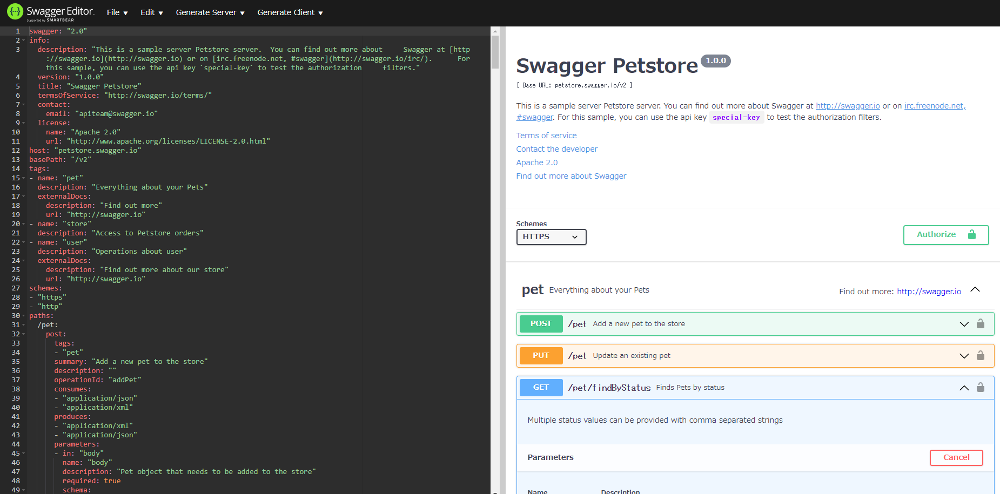
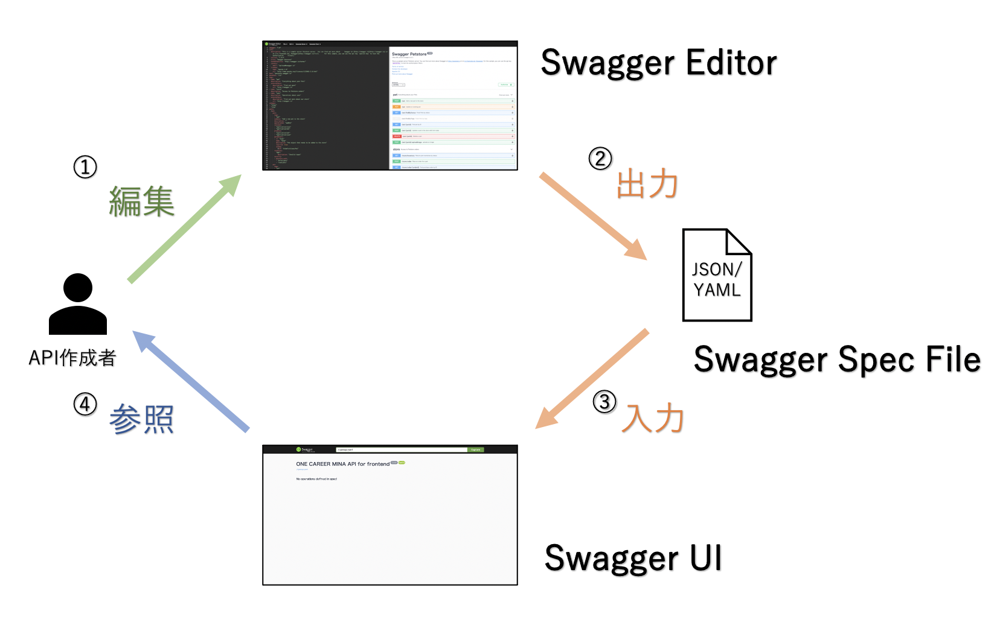

🌙 docker-swagger
====


## 📗 プロジェクトの概要

Swagger のサンプルです。Dockerを起動するとSwagger を利用する為の環境が整います。

## 🌐 Demo





## 💬 使い方

```
# Docker でSwaggerを起動します。
$ docker-compose up -d

# Docker を停止します。
$ docker-compose down
```

Swagger Editor

http://localhost:8001/


Swagger UI

http://localhost:8002/


Swagger API mock

http://localhost:8003/users


## 🎨 参考

| プロジェクト| 概要|
| :---------------------------------------| :-------------------------------|
| [Swaggerの記法まとめ](https://qiita.com/rllllho/items/53a0023b32f4c0f8eabb)| Swaggerの記法まとめ|


## 🎫 Licence

[MIT](https://github.com/isystk/docker-swagger/blob/master/LICENSE)

## 👀 Author

[isystk](https://github.com/isystk)

